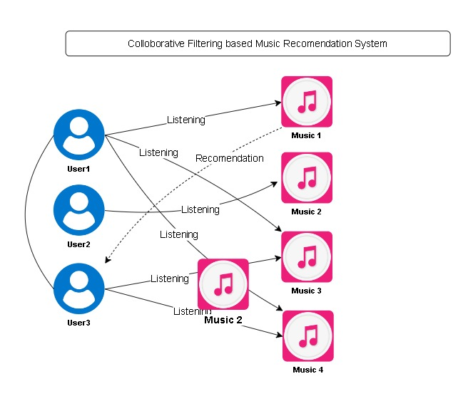
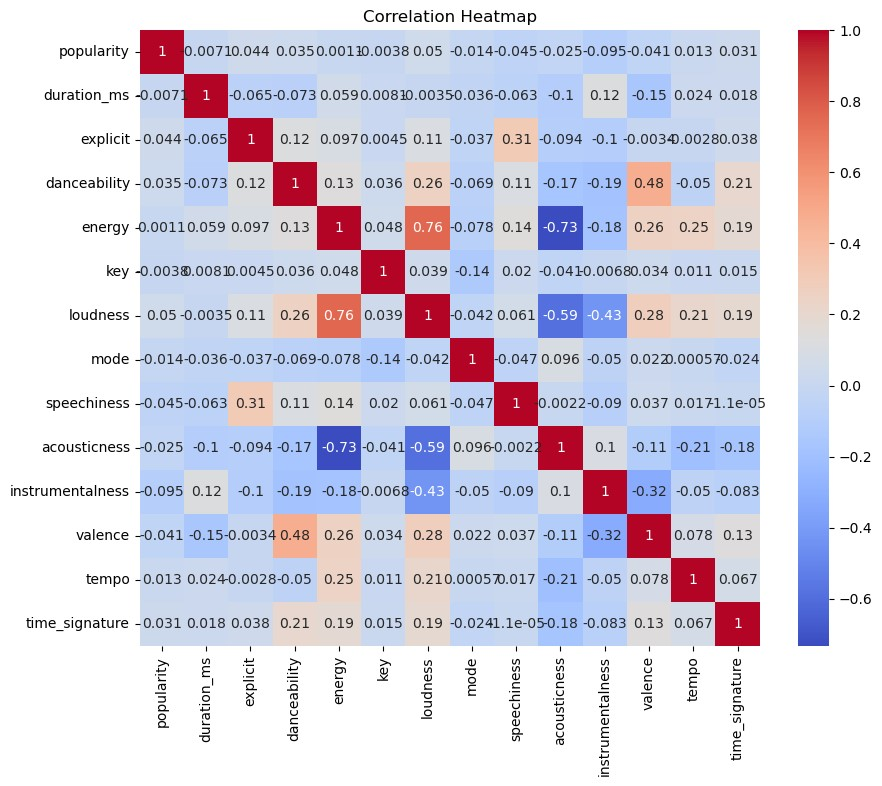
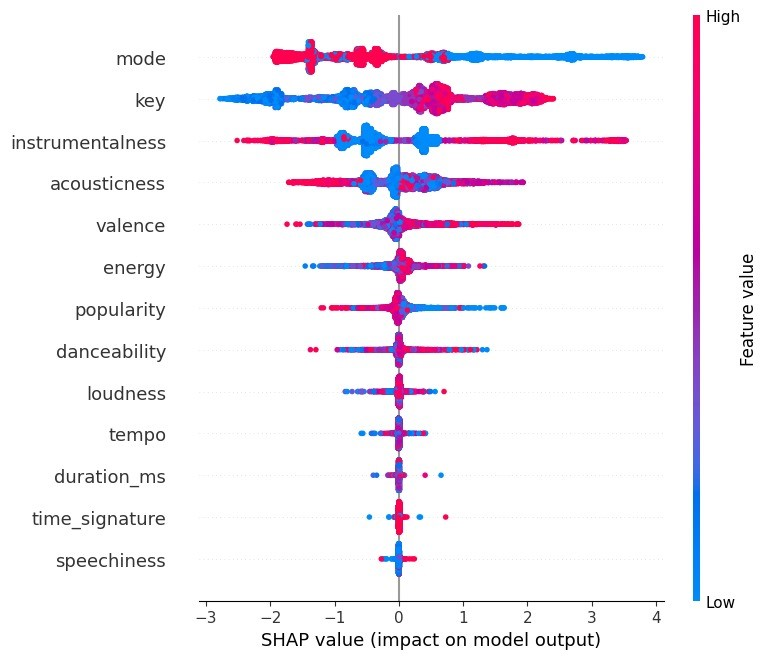

# Song-Recommendation-system-using-two-way-approach

Project Name: Analyzing SHAP Explanations for Enhanced Music Recommendations in Big Data using PySpark 

## Objective:
To develop a robust music recommendation system using big data technologies. This project leverages Pyspark for data processing, K-Means clustering for user segmentation, and advanced data analytics techniques to provide personalized music recommendations.

## Overview:
This project aims to address the challenges in the music industry related to personalizing music recommendations for users. By utilizing large datasets and advanced clustering techniques, we aim to improve user satisfaction and engagement. The system processes extensive user and song data to create meaningful recommendations that align with individual user preferences.

## The need:
In the contemporary digital music landscape, users have access to millions of songs across various platforms. With such an overwhelming amount of content, users often struggle to find music that matches their tastes. Traditional recommendation systems based on simple metrics like genre or popularity fail to capture the nuanced preferences of individual users. Therefore, there is a pressing need for a sophisticated recommendation system that can analyze large volumes of data to discern user preferences and provide accurate, personalized music suggestions. This need drives the development of our advanced recommendation system.

## About:
This music recommendation system project is developed using Pyspark, which provides a scalable and efficient way to handle big data. The project includes the following key components:

Data Processing: Handling and cleaning large datasets using Pyspark.
User Segmentation: Implementing K-Means clustering to segment users based on their listening habits and preferences.
Recommendation Algorithm: Developing a recommendation algorithm that uses user segments to suggest songs that are most likely to be appreciated by the users.
Evaluation: Assessing the performance of the recommendation system using relevant metrics.

The ultimate goal of this project is to enhance the user experience by delivering personalized music recommendations, leveraging the power of big data and machine learning.

## Contributors:
Nikunj Jain - Amrita School of Computing, Amrita Vishwa Vidyapeetham, Bengaluru

## Images

.
.

## Feedback and Issues:
We welcome feedback, suggestions, and bug reports. Please mail at nikunjcollege@gmail.com for any queries or for enhanced work.
